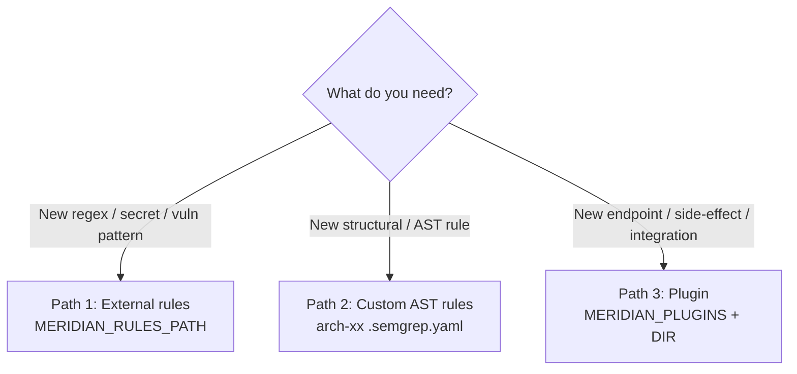

# Extending Meridian: the three paths

Meridian is intentionally extensible without forking. There are exactly three supported ways to add your own detection or behaviour, each suited to a different need.

## Path 1 — External rules (`MERIDIAN_RULES_PATH`)

**Use when:** you want to add regex-based detections to Gate 1 — secrets, dangerous calls, policy patterns.

- Mechanism: a JSON file with `risk_patterns[]`, `secret_patterns[]`, `vuln_patterns[]`.
- No rebuild, no code. Edit JSON, restart.
- Lowest effort, highest leverage for most teams.
- Details: [Custom risk rules](custom-risk-rules.md) · [Rules schema](../configuration/rules-schema.md)

## Path 2 — Custom AST rules (`arch-xx` Semgrep files)

**Use when:** a regex is not enough and you need *structural* understanding — "a route handler with no auth middleware", "a DB query missing a tenant filter".

- Mechanism: Semgrep-compatible `.semgrep.yaml` rules following the built-in `arch-01` … `arch-16` format.
- **Current limitation:** there is no `MERIDIAN_AST_RULES_DIR`. Custom AST rules must be added to `meridian/core/ast-spec/` (build-time) or carried by a plugin. This is the rough edge — be honest with yourself about the maintenance cost.
- Details: [Custom AST rules](custom-ast-rules.md) · [AST rules catalog](../reference/ast-rules-catalog.md)

## Path 3 — Plugins (`MERIDIAN_PLUGINS` + `MERIDIAN_PLUGINS_DIR`)

**Use when:** you need behaviour beyond detection — a new HTTP route, a side-effect (notify Slack, mirror an RFC to your ticketing system), or to bundle rules with code.

- Mechanism: a Node.js module exposing `init()` and `handleRoute()`.
- Loaded by name from `MERIDIAN_PLUGINS`, resolved from `MERIDIAN_PLUGINS_DIR`.
- Details: [Plugin authoring](plugin-authoring.md)

## Choosing

| You want to… | Path | Effort | Rebuild? |
|---|---|---|---|
| Catch a hardcoded internal token | 1 (rules) | Minutes | No |
| Flag missing auth on a route | 2 (AST) | Hours | Yes (today) |
| Post blocked RFCs to Slack | 3 (plugin) | Hours | No (mount dir) |
| Add a custom API endpoint | 3 (plugin) | Hours | No |

Read the honest limitations before you commit: [Gaps and roadmap](gaps-and-roadmap.md).

