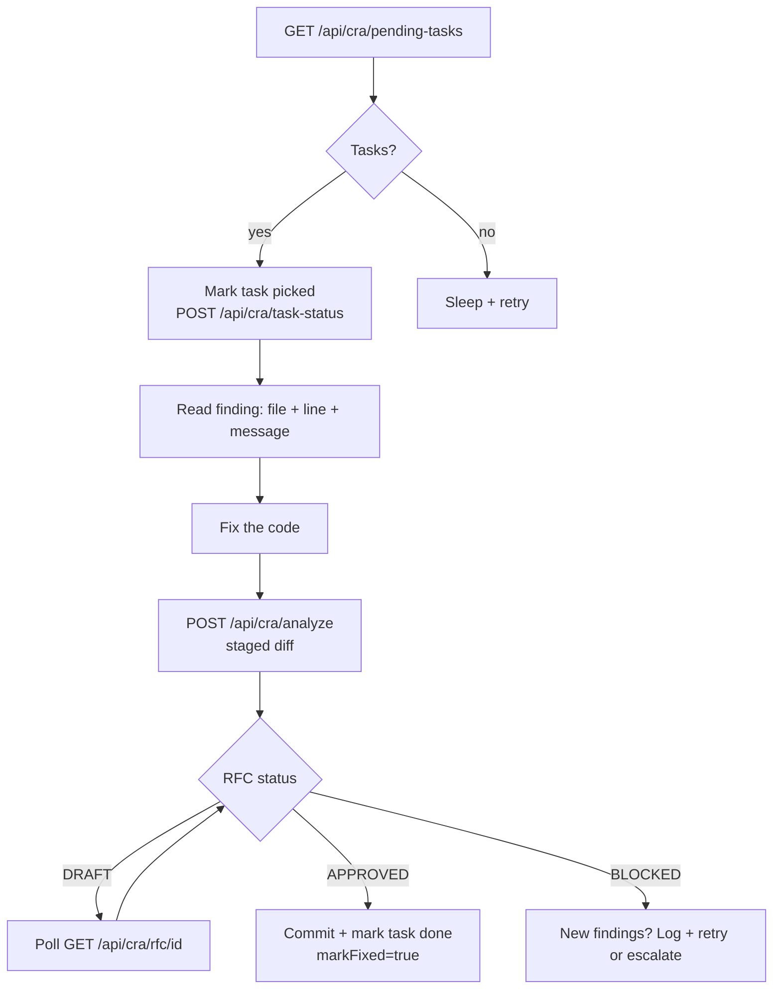

# How-to: build an agentic fix-and-verify loop

This guide shows how to wire Meridian into an autonomous agent that **finds a blocked RFC → picks the task → fixes the code → re-analyzes → marks done**. The same pattern works for Claude Code, custom Node.js agents, Python bots, or any process that can call HTTP.

For Claude Code specifically, the [MCP server](../integrations/claude-code.md) is the shortest path. This guide covers the generic HTTP approach.

---

## The loop in one diagram



---

## Step 1 — Poll for pending tasks

```bash
TASKS=$(curl -s http://localhost:3011/api/cra/pending-tasks \
  -H "Authorization: Bearer $CRA_API_TOKEN")

TASK_ID=$(echo "$TASKS" | jq -r '.[0].taskId // empty')
[ -z "$TASK_ID" ] && { echo "No tasks."; exit 0; }

FILE_PATH=$(echo "$TASKS"   | jq -r '.[0].filePath // empty')
LINE_HINT=$(echo "$TASKS"   | jq -r '.[0].lineHint // empty')
FINDING=$(echo "$TASKS"     | jq -r '.[0].description')
FIX=$(echo "$TASKS"         | jq -r '.[0].suggestedFix // empty')
```

## Step 2 — Mark the task as picked

Do this **immediately** — prevents two agents from picking the same task.

```bash
curl -s -X POST http://localhost:3011/api/cra/task-status \
  -H "Content-Type: application/json" \
  -H "Authorization: Bearer $CRA_API_TOKEN" \
  -d "{\"taskId\":\"$TASK_ID\",\"status\":\"picked\"}"
```

## Step 3 — Apply the fix

Here the agent does the work — edits the file, runs a linter, runs unit tests. What this looks like depends on your stack:

=== "Claude Code (MCP)"

    The agent reads the finding, edits the file, and re-stages:
    
    ```
    Finding: SQL injection in src/routes/search.js:42
    Suggested fix: pool.query('SELECT ... WHERE id=?', [id])
    
    Claude edits src/routes/search.js
    git add src/routes/search.js
    ```

=== "Script"

    ```bash
    # Example: apply a patch generated by your LLM
    patch -p1 < "$FIX_PATCH_FILE"
    git add "$FILE_PATH"
    ```

=== "Python agent"

    ```python
    import subprocess, textwrap
    # Call your LLM to generate the fix, write it, stage it
    subprocess.run(["git", "add", file_path], check=True)
    ```

## Step 4 — Re-analyze

```bash
DIFF=$(git diff --cached --no-color)
BRANCH=$(git rev-parse --abbrev-ref HEAD)

RESP=$(curl -s -X POST http://localhost:3011/api/cra/analyze \
  -H "Content-Type: application/json" \
  -H "Authorization: Bearer $CRA_API_TOKEN" \
  --data "$(jq -nc \
    --arg repo   "$REPO_NAME" \
    --arg branch "$BRANCH" \
    --arg msg    "fix: $FINDING" \
    --arg diff   "$DIFF" \
    '{repo_name:$repo,branch:$branch,commit_message:$msg,diff:$diff}')")

RFC_ID=$(echo "$RESP" | jq -r '.rfc_id')
STATUS=$(echo "$RESP" | jq -r '.overall_status')

# Poll while DRAFT
for _ in $(seq 1 30); do
  [ "$STATUS" = "DRAFT" ] || break
  sleep 2
  STATUS=$(curl -s "http://localhost:3011/api/cra/rfc/$RFC_ID" \
    -H "Authorization: Bearer $CRA_API_TOKEN" | jq -r '.overall_status')
done
```

## Step 5 — Branch on result

```bash
if [ "$STATUS" = "APPROVED" ] || [ "$STATUS" = "OVERRIDDEN" ]; then
  # Commit and mark done
  git commit -m "fix: $FINDING [meridian-$TASK_ID]"
  curl -s -X POST http://localhost:3011/api/cra/task-status \
    -H "Content-Type: application/json" \
    -H "Authorization: Bearer $CRA_API_TOKEN" \
    -d "{\"taskId\":\"$TASK_ID\",\"status\":\"done\",\"markFixed\":true}"
  echo "Done — $RFC_ID APPROVED."
else
  # Log failure — do not retry blindly
  echo "$RESP" | jq -r '.gates|to_entries[]|.value.findings[]?|"  [\(.severity)] \(.id): \(.message)"'
  curl -s -X POST http://localhost:3011/api/cra/task-status \
    -H "Content-Type: application/json" \
    -H "Authorization: Bearer $CRA_API_TOKEN" \
    -d "{\"taskId\":\"$TASK_ID\",\"status\":\"failed\"}"
fi
```

---

## Retry discipline

**Do not retry blindly.** If a fix attempt is still blocked, the new findings may be different from the original — your fix changed something but not everything. Standard practice:

1. On first BLOCKED → attempt fix, re-analyze.
2. On second BLOCKED → log both finding sets; mark `failed`; escalate to human review.
3. Never loop more than 2 fix attempts per task without a human checkpoint.

This matches the global rule: **2 Fehlversuche → STOP, Root-Cause-Analyse, User informieren**.

---

## CLAUDE.md template for agentic repos

Add to your project's `CLAUDE.md` to make the workflow self-documenting for Claude Code:

```markdown
## Meridian agentic workflow

**Before any commit:**
1. Call `cra.analyze` (MCP) or run `scripts/meridian-check.sh` (pre-commit hook).
2. Poll until RFC status is terminal (not DRAFT).
3. On BLOCKED: fix the finding and re-analyze. Do not use `git commit --no-verify`.

**Picking tasks from the queue:**
1. `GET /api/cra/pending-tasks` → pick first task.
2. Mark `picked` immediately.
3. Apply fix → git add → `cra.analyze`.
4. Mark `done` + `markFixed=true` on APPROVED; mark `failed` on second block.

**Two failed fix attempts → STOP and explain to the user.**

**Before production deploy:** `cra.prod_check(repo=<repo>)` must return `allowed=true`.
```

---

## Complete reference flow (curl)

```bash
#!/usr/bin/env bash
# Minimal agentic fix loop — illustrative, not production-ready
set -euo pipefail

MERIDIAN_URL="${MERIDIAN_URL:-http://localhost:3011}"
TOKEN="${CRA_API_TOKEN:-}"
REPO="${MERIDIAN_REPO:-my-api}"

# 1. Fetch a pending task
TASKS=$(curl -s "$MERIDIAN_URL/api/cra/pending-tasks" -H "Authorization: Bearer $TOKEN")
TASK_ID=$(echo "$TASKS" | jq -r '.[0].taskId // empty')
[ -z "$TASK_ID" ] && { echo "No pending tasks."; exit 0; }

FINDING=$(echo "$TASKS" | jq -r '.[0].description')
echo "[agent] Task $TASK_ID: $FINDING"

# 2. Mark picked
curl -s -X POST "$MERIDIAN_URL/api/cra/task-status" \
  -H "Content-Type: application/json" \
  -H "Authorization: Bearer $TOKEN" \
  -d "{\"taskId\":\"$TASK_ID\",\"status\":\"picked\"}" > /dev/null

# 3. --- YOUR FIX LOGIC HERE ---
# e.g. call your LLM, apply patch, git add <file>
echo "[agent] Fix applied — re-staging..."
# git add <fixed-file>

# 4. Re-analyze
DIFF=$(git diff --cached --no-color)
RESP=$(curl -s -X POST "$MERIDIAN_URL/api/cra/analyze" \
  -H "Content-Type: application/json" \
  -H "Authorization: Bearer $TOKEN" \
  --data "$(jq -nc --arg r "$REPO" --arg d "$DIFF" --arg m "fix: $FINDING" \
    '{repo_name:$r,branch:"main",commit_message:$m,diff:$d}')")

RFC_ID=$(echo "$RESP" | jq -r '.rfc_id')
STATUS=$(echo "$RESP" | jq -r '.overall_status')
for _ in $(seq 1 30); do
  [ "$STATUS" = "DRAFT" ] || break; sleep 2
  STATUS=$(curl -s "$MERIDIAN_URL/api/cra/rfc/$RFC_ID" \
    -H "Authorization: Bearer $TOKEN" | jq -r '.overall_status')
done

# 5. Branch on result
FINAL_STATUS="done"
[ "$STATUS" = "APPROVED" ] || [ "$STATUS" = "OVERRIDDEN" ] || FINAL_STATUS="failed"

curl -s -X POST "$MERIDIAN_URL/api/cra/task-status" \
  -H "Content-Type: application/json" \
  -H "Authorization: Bearer $TOKEN" \
  -d "{\"taskId\":\"$TASK_ID\",\"status\":\"$FINAL_STATUS\",\"markFixed\":$([ "$FINAL_STATUS" = "done" ] && echo true || echo false)}" > /dev/null

echo "[agent] Task $TASK_ID → $FINAL_STATUS (RFC $RFC_ID: $STATUS)"
```

---

Next: [Gate AI-generated code](ai-generated-code.md) · [Block and override](block-and-override.md) · [Claude Code integration](../integrations/claude-code.md)
