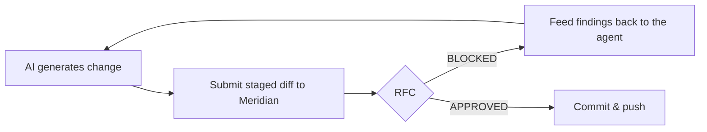

# How-to: gate AI-generated code (Claude / Cursor / Copilot)

**Prerequisites**

- A running Meridian instance ([Docker Compose](../getting-started/docker-compose.md))
- An AI coding tool (Claude Code, Cursor, GitHub Copilot, etc.)
- `CRA_API_TOKEN` if auth is enabled

**What you'll have after**

A loop where AI-generated diffs are checked by Meridian *before* they reach your remote, with the agent fixing what gets blocked.

## The core idea

AI assistants produce volume. The win is to put Meridian *as close to the agent as possible* so blocks become immediate feedback the agent can act on, not a surprise at push time.



## Step 1 — A pre-commit check script

Add `scripts/meridian-check.sh` to your repo:

```bash
#!/usr/bin/env bash
set -euo pipefail
MERIDIAN_URL="${MERIDIAN_URL:-http://localhost:3011}"
TOKEN="${CRA_API_TOKEN:-}"

DIFF="$(git diff --cached --no-color)"
[ -z "$DIFF" ] && { echo "No staged changes."; exit 0; }
MSG="$(git log -1 --format=%s 2>/dev/null || echo 'wip')"

RESP="$(curl -s -X POST "$MERIDIAN_URL/api/cra/analyze" \
  -H 'Content-Type: application/json' \
  -H "Authorization: Bearer $TOKEN" \
  --data "$(jq -nc --arg m "$MSG" --arg d "$DIFF" \
    '{repo_name:"local",branch:"local",commit_message:$m,diff:$d}')")"

RFC_ID="$(echo "$RESP" | jq -r '.rfc_id')"
STATUS="$(echo "$RESP" | jq -r '.overall_status')"
for _ in $(seq 1 30); do
  [ "$STATUS" = "DRAFT" ] || break; sleep 1
  STATUS="$(curl -s "$MERIDIAN_URL/api/cra/rfc/$RFC_ID" -H "Authorization: Bearer $TOKEN" | jq -r '.overall_status')"
done

if [ "$STATUS" = "APPROVED" ] || [ "$STATUS" = "OVERRIDDEN" ]; then
  echo "Meridian: $STATUS ($RFC_ID)"; exit 0
fi
echo "Meridian: $STATUS ($RFC_ID) — findings:" >&2
echo "$RESP" | jq -r '.gates | to_entries[] | .value.findings[]? | "  [\(.severity)] \(.id): \(.message // "")"' >&2
exit 1
```

Wire it as a Git pre-commit hook (`.git/hooks/pre-commit` → call the script) or run it manually.

## Step 2 — Make the findings agent-readable

When blocked, the script prints findings like:

```text
Meridian: BLOCKED (rfc_01HZ...) — findings:
  [critical] secret-aws-access-key: Hardcoded AWS access key
  [high] vuln-command-injection: Possible command injection via interpolated child_process call
```

Paste that straight back to Claude/Cursor: *"Meridian blocked this with the following findings, fix them."* Agents handle these well because each finding names the exact problem.

## Step 3 — Tool-specific notes

=== "Claude Code / Cursor (agentic)"

    Add the check to the agent's task loop or as a pre-commit hook. The agent runs the change, the hook blocks, the agent reads the findings and iterates. This is the highest-leverage setup — the agent self-corrects before anything leaves the machine.

=== "GitHub Copilot (inline)"

    Copilot doesn't run a loop, so rely on the pre-commit hook plus the CI gate. The hook catches it locally; the [GitHub Actions gate](../integrations/github.md) is the backstop for whatever slips through.

## Step 4 — Backstop with a server-side gate

Local hooks can be skipped (`git commit --no-verify`). Always pair the local loop with a server-side [pre-receive](../integrations/forgejo.md) or [CI](../integrations/github.md) gate so a skipped local check still cannot ship.

## Troubleshooting

| Symptom | Likely cause | Fix |
|---|---|---|
| Hook not running | Not executable / wrong path | `chmod +x .git/hooks/pre-commit` |
| Agent ignores findings | Findings not surfaced | Print findings to the agent's context as in step 2 |
| Everything blocks | Over-broad custom rule | Review [rules](../configuration/rules-schema.md) |
| Slow on every commit | Gate 3 latency | Use Ollama for local checks; full tiers in CI |

Next: [Block and override](block-and-override.md)

