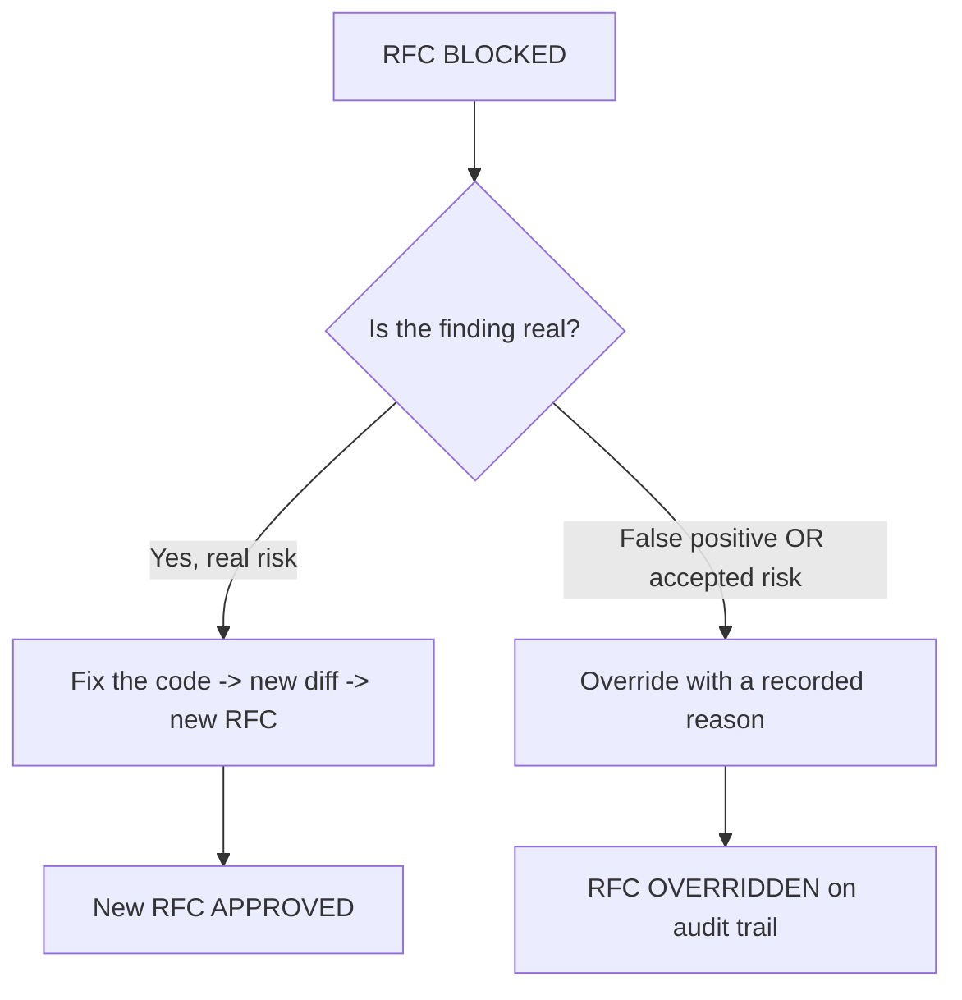

# How-to: when you're blocked, and how to override

**Prerequisites**

- A `BLOCKED` RFC (see [Your first analysis](../getting-started/first-analysis.md))
- The RFC id and the override authority/credentials your deployment requires

**What you'll have after**

A clear decision procedure for a block, and the exact steps to record an override on the audit trail when a block is a false positive or an accepted risk.

## What "blocked" means

A `BLOCKED` RFC means at least one gate produced a blocking finding. The change cannot pass an enforcing gate. You have exactly two honest paths:



## Path 1 — Fix the code (preferred)

Most blocks are correct. Fix the underlying issue and submit the new diff. Because the diff hash changes, you get a fresh RFC; the old one becomes `SUPERSEDED`.

```bash
# after editing the code and re-staging
scripts/meridian-check.sh   # from the AI-code how-to, or your CI step
```

Expected on success:

```text
Meridian: APPROVED (rfc_01J0...)
```

## Path 2 — Override (false positive or accepted risk)

An override does not erase the findings — it records that a human accepted them, with a reason, and that record is written to the [WORM audit trail](../scenarios/regulated.md). This is the legitimate way to handle a false positive without weakening the gate for everyone.

Review the RFC and its findings first:

```bash
curl -s http://localhost:3011/api/cra/rfc/rfc_01HY... \
  -H "Authorization: Bearer $CRA_API_TOKEN" \
  | jq '{status:.overall_status, findings:[.gates[].findings[]? | {id,severity,message}]}'
```

Then override the **exact RFC** for the current diff with a reason:

```bash
curl -s -X POST http://localhost:3011/api/cra/rfc/rfc_01HY.../override \
  -H 'Content-Type: application/json' \
  -H "Authorization: Bearer $CRA_API_TOKEN" \
  -d '{
    "actor": "alice@example.com",
    "reason": "vuln-command-injection is a false positive: input is an enum validated upstream in middleware/validate.js"
  }' | jq
```

Expected:

```json
{ "rfc_id": "rfc_01HY...", "overall_status": "OVERRIDDEN", "override": { "actor": "alice@example.com", "reason": "..." } }
```

!!! warning "Override the RFC that matches the current diff hash"
    Overrides are bound to a diff hash. If you push, rebase, then push again, the second push is a *different* RFC — the earlier override does not apply. Finish your work, rebase, push **once**, then override that RFC if needed. Do not push → rebase → re-push (two RFCs, override mismatch).

## Good override reasons vs bad ones

| Good (specific, defensible) | Bad (will not help an auditor) |
|---|---|
| "False positive: regex matched a string in a comment, not a real `exec`." | "FP" |
| "Accepted risk for hotfix; tracked in TICKET-123, remediation due 2026-06-09." | "need to ship" |
| "Key is a documented public test key, not a live credential." | "trust me" |

The override reason is part of the permanent record. Write it for the person who reads it in an audit a year from now.

## Troubleshooting

| Symptom | Likely cause | Fix |
|---|---|---|
| Override returns `404` | Wrong RFC id | Re-fetch the id from the analyze response |
| Override "didn't take" at push | Re-pushed a different diff | Override the RFC of the current diff hash; push once |
| `403`/permission denied | Override authority not granted | Use the credential/role your deployment authorizes for overrides |
| Need to undo an override | Overrides are recorded, not deleted | Submit a corrected diff → new RFC; the history remains |

Next: [LLM cost control](llm-cost-control.md)

