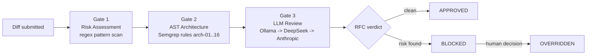

# Meridian — DevOps Gate

> A hard-blocking change gate for AI-generated code. Self-hosted, Apache-2.0, air-gap capable.

Meridian sits between a code change and your deploy. It analyses every diff through three gates, opens an **RFC** (Request for Change) that records the verdict, and **blocks the change** until that RFC is `APPROVED` or explicitly `OVERRIDDEN`. The decision is written to a tamper-evident (WORM) audit trail.

Unlike scanners that post advisory comments, Meridian is designed to **stop the merge/deploy** when a change is risky.

---

## The problem

AI coding assistants (Claude, Cursor, Copilot, etc.) now generate a large share of the code that reaches production. They are fast and frequently wrong in subtle ways: a hardcoded secret, a `child_process.exec` with interpolated input, a dropped tenant filter, an `eval()` on request data.

Traditional tools react to this in three unsatisfying ways:

- **Linters / SAST (Semgrep OSS, SonarQube)** — produce findings, but do not stop anything. The findings sit in a dashboard.
- **GHAS** — cloud-only, per-seat pricing, and still advisory by default.
- **Code review** — human, slow, and inconsistent at 2 a.m. when an agent opens 14 PRs.

None of them give you a single artifact that says *"this exact diff was reviewed, here is the verdict, here is who overrode it and why"* — and none of them refuse to let a bad change through.

## How it works — the 3 gates

Every diff submitted to Meridian flows through three gates in order. The first gate to produce a blocking finding stops the pipeline.



| Gate | What it does | Engine |
|------|--------------|--------|
| **① Risk Assessment** | Fast regex scan for secrets, dangerous calls, known vuln patterns | Built-in patterns + your `MERIDIAN_RULES_PATH` |
| **② AST Architecture Check** | Structural rules (`arch-01` … `arch-16`): missing auth, tenant-scope leaks, unsafe deserialization | Semgrep-compatible `.semgrep.yaml` |
| **③ LLM Review** | Reasoning pass that catches what regex/AST cannot, with a tiered, cost-capped router | Ollama → DeepSeek → Anthropic |

The outcome is an **RFC** that moves through a defined lifecycle:

```
DRAFT → BLOCKED | APPROVED | OVERRIDDEN → SUPERSEDED
```

See [What is an RFC?](start-here/what-is-a-rfc.md) for the full lifecycle.

## Meridian vs the alternatives

| | **Meridian** | Semgrep Team | GitHub Advanced Security | SonarQube | Snyk |
|---|---|---|---|---|---|
| Blocks the deploy (not advisory) | **Yes** | No (advisory) | No by default | No | No |
| RFC artifact per diff | **Yes** | No | No | No | No |
| WORM audit trail | **Yes** | No | No | No | No |
| LLM reasoning layer | **Yes** | No | No | No | Partial |
| Self-hosted | **Yes** | Partial | No (cloud) | Yes | No |
| Air-gap capable | **Yes** | No | No | Partial | No |
| License | **Apache-2.0** | Proprietary | Proprietary | LGPL/Commercial | Proprietary |
| Indicative price | **$0** | ~$450/mo | $19/seat/mo | $150+/mo | Quote |

> Pricing figures are indicative public list prices and change frequently; treat them as order-of-magnitude. The point is not that the others are bad — it is that none of them *block* and none of them keep a *WORM RFC*.

## Cost comparison

For a 10-developer team:

| Tool | Monthly | Annual |
|------|--------:|-------:|
| GitHub Advanced Security ($19/seat) | $190 | $2,280 |
| Semgrep Team | ~$450 | ~$5,400 |
| SonarQube (paid tier) | $150+ | $1,800+ |
| **Meridian (Apache-2.0)** | **$0** | **$0** |

Meridian's only running cost is your own infrastructure plus optional LLM API spend, which is hard-capped via `LLM_DAILY_CAP_USD` and can be **$0** if you run Ollama only. See [LLM cost control](how-to/llm-cost-control.md).

## Quickstart

```bash
git clone https://github.com/weilmaschinchen/meridian.git
cd meridian
docker compose up -d --build

# Verify
curl -s http://localhost:3011/api/cra/health
# {"status":"ok", ...}
```

Full walkthrough: [Docker Compose](getting-started/docker-compose.md) → [Your first analysis](getting-started/first-analysis.md).

## Who is this for?

- **Solo developers** shipping AI-generated code who want a safety net without a SaaS subscription → [Solo dev scenario](scenarios/solo-dev.md)
- **Small teams** that want a consistent, automated gate instead of relying on whoever reviews the PR → [Small team scenario](scenarios/small-team.md)
- **Regulated industries** (fintech, healthcare) that need a defensible, tamper-evident record of every change decision → [Regulated scenario](scenarios/regulated.md)

## Where to go next

- New to gates? Start with [What is a change gate?](start-here/what-is-a-gate.md)
- Want it running now? [Docker Compose](getting-started/docker-compose.md)
- Want to wire it into CI? [Forgejo](integrations/forgejo.md) or [GitHub](integrations/github.md)
- Want to extend it? [External Patterns overview](external-patterns/overview.md)

!!! note "Honesty first"
    This documentation calls out what Meridian **cannot** do yet (see [Gaps and roadmap](external-patterns/gaps-and-roadmap.md)). For example, there is no `MERIDIAN_AST_RULES_DIR` — custom Semgrep rules currently require adding files to `meridian/core/ast-spec/` or shipping a plugin. We would rather you know that up front.

