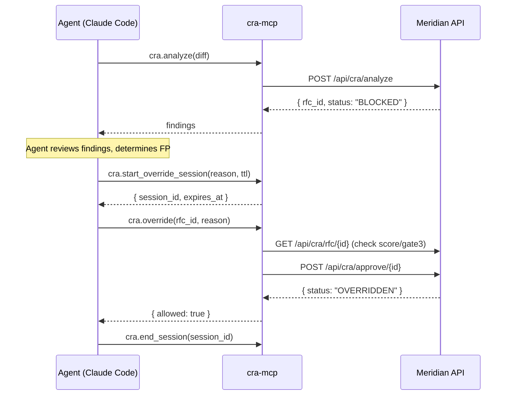

# MCP tools reference

Meridian ships a [Model Context Protocol](https://modelcontextprotocol.io/) server (`cra-mcp`) that lets LLM assistants — Claude Code, Cursor, custom agents — call Meridian natively without writing curl scripts.

The MCP server is a **thin client** that talks to your Meridian HTTP API. It does not embed the gate logic; it routes calls to a running Meridian instance.

**Source:** [`meridian/packages/mcp-cra/`](https://github.com/weilmaschinchen/meridian) (bundled with this repo)

---

## Installation

### 1 — Build the MCP server

```bash
cd packages/mcp-cra
npm install
npm run build      # compiles TypeScript → dist/index.js
```

### 2 — Store credentials in the macOS Keychain

The server reads tokens from the macOS Keychain, never from environment variables or files.

```bash
# API token (required) — used for all read + analyze calls
security add-generic-password \
  -s cra-mcp \
  -a meridian \
  -w "$CRA_API_TOKEN"

# Override token (optional) — enables cra.override; omit for read-only mode
security add-generic-password \
  -s cra-mcp-override \
  -a meridian \
  -w "$CRA_OVERRIDE_TOKEN"
```

For Linux/Windows, set `CRA_MCP_TOKEN` and `CRA_MCP_OVERRIDE_TOKEN` as environment variables and patch `keychain.ts` to read `process.env` instead of `security(1)`.

### 3 — Point the server at your Meridian instance

Set `CRA_BASE_URL` before launching (defaults to `http://localhost:3011`):

```bash
export CRA_BASE_URL=https://meridian.example.com
```

Or hardcode it in `packages/mcp-cra/src/cra-client.ts`:

```typescript
const DEFAULT_BASE = 'https://meridian.example.com';
```

### 4 — Register in Claude Code

Add to `~/.claude.json` (global, all projects):

```json
{
  "mcpServers": {
    "cra": {
      "command": "node",
      "args": ["/path/to/meridian/packages/mcp-cra/dist/index.js"],
      "env": {
        "CRA_BASE_URL": "https://meridian.example.com"
      }
    }
  }
}
```

Or for a single project, add to `.claude/mcp.json` in the project root.

Restart Claude Code. Run `/mcp` to confirm `cra` appears as connected.

---

## Authentication

| Token | Keychain service | Purpose |
|---|---|---|
| `CRA_API_TOKEN` | `cra-mcp` | All read and analyze operations |
| `CRA_OVERRIDE_TOKEN` | `cra-mcp-override` | `cra.override` only; omit for read-only |

If `CRA_OVERRIDE_TOKEN` is absent, `cra.override` is hidden from the tool list entirely.

---

## Tools

### `cra.analyze`

Submit a unified diff for CRA analysis. Creates an RFC and runs the 3-gate pipeline (risk patterns → AST → LLM review). Returns immediately with the initial result; if status is `DRAFT`, poll via `cra.get_rfc`.

**Input**

| Field | Type | Required | Default | Description |
|---|---|---|---|---|
| `repo_name` | string | yes | — | Repository identifier, e.g. `my-api` |
| `diff` | string | yes | — | Unified git diff (`git diff --cached`) |
| `commit_message` | string | no | `""` | Commit or change description |
| `branch` | string | no | `main` | Branch being changed |
| `diff_source` | `local` \| `pre-commit` \| `github-pr` \| `github-compare` | no | `local` | Where the diff originated |

**Output**

```json
{
  "rfc_id": "RFC-9F2C4A1B",
  "overall_status": "BLOCKED",
  "risk_score": 24,
  "gates": {
    "risk": {
      "status": "fail",
      "findings": [
        {
          "id": "secret-aws-access-key",
          "severity": "critical",
          "message": "Hardcoded AWS access key"
        }
      ]
    },
    "ast":  { "status": "pass", "findings": [] },
    "llm":  { "status": "pass", "findings": [] }
  }
}
```

**Example prompt**

> "Run a Meridian check on my staged diff before I commit."

Claude Code will call `git diff --cached`, pass it to `cra.analyze`, and surface any findings.

---

### `cra.get_rfc`

Retrieve the full state of one RFC, including gate results and override history.

**Input**

| Field | Type | Required | Description |
|---|---|---|---|
| `rfc_id` | string (pattern `RFC-[A-F0-9]+`) | yes | RFC identifier returned by `cra.analyze` |

**Output**

```json
{
  "rfc_id": "RFC-9F2C4A1B",
  "repo_name": "my-api",
  "branch": "feature/login",
  "overall_status": "BLOCKED",
  "created_at": "2026-06-08T10:00:00Z",
  "gates": { ... },
  "override": null
}
```

Use this to poll for terminal status after `cra.analyze` returns `DRAFT`.

---

### `cra.list_blockers`

List RFCs with status `BLOCKED`, optionally filtered to a specific repository.

**Input**

| Field | Type | Required | Default | Description |
|---|---|---|---|---|
| `repo` | string | no | — | Filter by repository name |
| `limit` | integer (1–100) | no | `20` | Maximum results |

**Output**

```json
{
  "total": 2,
  "rfcs": [
    { "rfc_id": "RFC-9F2C...", "repo_name": "my-api", "overall_status": "BLOCKED", ... },
    { "rfc_id": "RFC-A31D...", "repo_name": "my-api", "overall_status": "BLOCKED", ... }
  ]
}
```

---

### `cra.prod_check`

Check whether a repository is cleared for a production deploy. Returns the latest RFC and whether it blocks deployment.

**Input**

| Field | Type | Required | Description |
|---|---|---|---|
| `repo` | string | yes | Repository name, e.g. `my-api` |

**Output**

```json
{
  "allowed": false,
  "rfcId": "RFC-9F2C4A1B",
  "riskScore": 24,
  "reason": "RFC is BLOCKED — 1 critical finding in Gate 1",
  "approveUrl": "https://meridian.example.com/cra#approve-RFC-9F2C4A1B"
}
```

Wire this into your deploy workflow before shipping to production.

---

### `cra.ops_log`

Record an operational event — deploy, test run, config change — to the Meridian audit trail. Use when there is no code diff to submit.

**Input**

| Field | Type | Required | Default | Description |
|---|---|---|---|---|
| `action` | string | yes | — | Short action name, e.g. `deploy-staging` |
| `description` | string | yes | — | Human-readable description |
| `app` | string | no | `kursmanager-platform` | Application identifier |
| `environment` | `staging` \| `production` \| `local` \| `main` | no | `staging` | Target environment |

**Output**

```json
{ "ok": true, "logged": true }
```

---

### `cra.start_override_session`

Start an override session. Required before `cra.override` can perform bulk overrides. Sessions enforce a TTL, a maximum risk-score cap, and a per-session override budget.

Sessions persist across MCP restarts.

**Requires:** override token in Keychain.

**Input**

| Field | Type | Required | Default | Description |
|---|---|---|---|---|
| `reason` | string (≥ 20 chars) | yes | — | Why this session is needed |
| `ttl_minutes` | integer (1–60) | no | `60` | Session lifetime |
| `max_score` | integer | no | system default | Override the max risk-score cap |
| `max_overrides` | integer | no | system default | Override budget (max overrides this session) |

**Output**

```json
{
  "id": "s_8a4f21bc-...",
  "reason": "Bulk FP sweep — all detections verified against test fixtures",
  "expires_at": "2026-06-08T11:00:00Z",
  "max_overrides": 5,
  "used": 0
}
```

---

### `cra.list_sessions`

List active (non-expired) override sessions.

**Input:** none

**Output**

```json
{
  "count": 1,
  "sessions": [
    {
      "id": "s_8a4f21bc-...",
      "reason": "...",
      "expires_at": "...",
      "max_overrides": 5,
      "used": 1
    }
  ]
}
```

---

### `cra.end_session`

End an override session before its TTL expires. Any further override attempts using this session will be denied.

**Input**

| Field | Type | Required | Description |
|---|---|---|---|
| `session_id` | string (pattern `s_[0-9a-f-]+`) | yes | Session ID from `cra.start_override_session` |

**Output**

```json
{ "ended": true }
```

---

### `cra.override`

Override a `BLOCKED` RFC. Records the override on the WORM audit trail.

**Requires:** override token in Keychain + an active session from `cra.start_override_session`.

**Hard limits (cannot be bypassed by any session):**

- Findings `vuln-01` through `vuln-10` (critical vulnerability patterns) always require manual dashboard approval.
- If Gate 3 returned `FAIL`, dashboard approval is mandatory.

When either limit is hit, the tool returns `{ "allowed": false, "requiresDashboardApproval": true, "approveUrl": "..." }` with the dashboard link — do not retry programmatically.

**Input**

| Field | Type | Required | Description |
|---|---|---|---|
| `rfc_id` | string (pattern `RFC-[A-F0-9]+`) | yes | RFC to override |
| `reason` | string (≥ 20 chars) | yes | Permanent recorded justification |

**Output (approved)**

```json
{
  "allowed": true,
  "rfc_id": "RFC-9F2C4A1B",
  "overall_status": "OVERRIDDEN"
}
```

**Output (escalated to dashboard)**

```json
{
  "allowed": false,
  "reason": "Finding vuln-03 always requires per-call dashboard approval.",
  "requiresDashboardApproval": true,
  "approveUrl": "https://meridian.example.com/cra#approve-RFC-9F2C4A1B"
}
```

---

## Session lifecycle



---

## Error responses

All tools return plain text starting with `ERROR:` on failure:

```
ERROR: CRA POST /api/cra/analyze failed: HTTP 401
ERROR: Keychain lookup failed for service=cra-mcp account=meridian: ...
ERROR: RFC RFC-9F2C4A1B not found
```

The `isError: true` flag is also set so the calling LLM knows not to parse it as data.

---

## Audit trail

Every tool call is appended to a local JSON-Lines audit log at `~/.meridian/mcp-audit.jsonl` (configurable via `MERIDIAN_MCP_AUDIT_PATH`):

```json
{"ts":"2026-06-08T10:12:00Z","tool":"cra.analyze","args":{"repo":"my-api","branch":"main","diffSize":312},"result":"ok"}
{"ts":"2026-06-08T10:12:05Z","tool":"cra.override","args":{"rfc_id":"RFC-9F2C4A1B"},"result":"ok","sessionId":"s_8a4f..."}
```

This is separate from the server-side WORM audit trail written by Meridian itself.

---

## Security model

| Concern | How it is handled |
|---|---|
| Token storage | macOS Keychain (never env vars or files) |
| Token in logs | `CraClient` never logs the token value |
| Override capability | Only exposed when `cra-mcp-override` Keychain entry exists |
| Hard limits | `vuln-01..10` and Gate 3 FAIL always require dashboard approval regardless of session |
| Audit | Every call logged locally; override calls also recorded server-side on WORM trail |

See [Authentication & RBAC](auth.md) for the full server-side access model.
