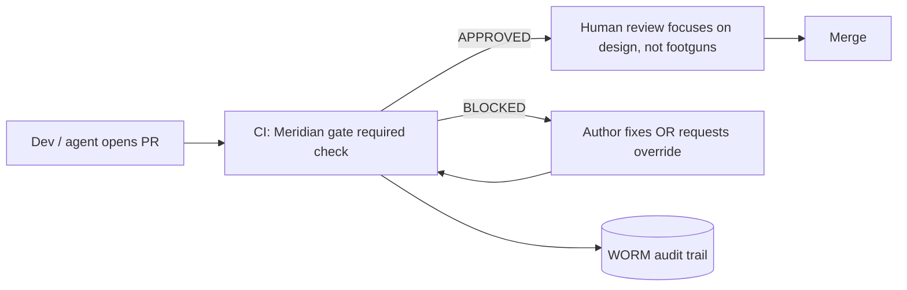

# Scenario: small team

## Who this is for

A team of 3–15 developers. You have a shared repo, you do PR review, and review quality varies with who is on call and how busy they are. Some of your code is AI-generated; you want a consistent, automated floor under every change.

## The risk

Human review is inconsistent. A careful reviewer catches the dropped tenant filter; a rushed one rubber-stamps it. As AI tooling raises PR volume, review quality drops further. You need a gate that applies the *same* standard to every diff, every time, and that cannot be skipped by the author.

## The setup

1. **Run one shared Meridian instance** with auth enabled:

   ```bash
   # .env
   MERIDIAN_AUTH_ENABLED=true
   CRA_API_TOKEN=<long-random-token>
   OLLAMA_BASE_URL=http://ollama:11434
   DEEPSEEK_API_KEY=sk-...      # cheap cloud fallback
   LLM_DAILY_CAP_USD=5.00       # bounded team-wide spend
   CRA_MINIO_ENDPOINT=http://minio:9000
   ```

2. **Enforce in CI as a required check** — [GitHub](../integrations/github.md) or [Forgejo pre-receive](../integrations/forgejo.md). The author cannot merge a `BLOCKED` RFC.

3. **Give developers fast local feedback** with the pre-commit script from [AI-generated code](../how-to/ai-generated-code.md), pointed at the shared instance (or a local Ollama for speed).

4. **Define team rules once** in a shared `MERIDIAN_RULES_PATH` file checked into config — your internal token formats, banned calls, etc. See [Custom risk rules](../external-patterns/custom-risk-rules.md).

## The workflow



Meridian handles the mechanical checks (secrets, injection, missing auth), so human review can spend its scarce attention on design and intent.

## Handling false positives without weakening the gate

A shared gate will occasionally false-positive. Do **not** loosen rules for everyone — use the recorded [override](../how-to/block-and-override.md) with a specific reason. The override lands on the audit trail, so the team can see what was accepted and why. Tighten or fix the rule afterward if it keeps misfiring.

## What you get

- One consistent standard applied to every diff regardless of reviewer.
- A backstop that survives "LGTM" reviews on a busy day.
- An audit trail of every block and override — useful for retros and onboarding ("why did we accept this?").
- Bounded cost via `LLM_DAILY_CAP_USD`.

## Honest caveats

- Wire enforcement deliberately; analysis without a required check is just a dashboard.
- Mind the diff-hash rule on rebases (override the RFC of the *current* diff; push once) — see [Block and override](../how-to/block-and-override.md).
- Custom AST rules still need a build step today ([gaps](../external-patterns/gaps-and-roadmap.md)).

Next: [Regulated industry scenario](regulated.md)

