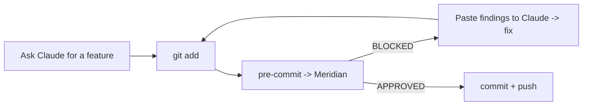

# Scenario: solo developer + AI tools

## Who this is for

A single developer shipping a side project or small product, leaning heavily on Claude Code / Cursor / Copilot. You move fast, there is no second reviewer, and you do not want a SaaS subscription just to keep yourself honest.

## The risk

When you are the only reviewer, you are also the bottleneck and the blind spot. AI tools cheerfully produce a hardcoded key, an `exec` on user input, or a dropped auth check — and at 1 a.m. you will merge it. You need a second opinion that never gets tired and costs nothing.

## The setup (15 minutes)

1. **Run Meridian locally**, Ollama-only so it costs $0 and needs no API keys:

   ```bash
   git clone https://github.com/weilmaschinchen/meridian.git
   cd meridian
   echo 'OLLAMA_BASE_URL=http://host.docker.internal:11434' > .env
   docker compose up -d --build
   ```
   (See [Docker Compose](../getting-started/docker-compose.md) and [LLM cost control → Setup A](../how-to/llm-cost-control.md).)

2. **Add a pre-commit hook** that runs the check script from [AI-generated code](../how-to/ai-generated-code.md). Now every commit is gated before it exists.

3. **Feed blocks back to your AI tool.** When the hook prints findings, paste them to the agent and let it fix them.

## A day in this workflow



## What you get

- A tireless second reviewer for $0.
- No code leaves your machine (air-gap friendly) if you stay Ollama-only.
- A growing set of RFCs — useful even solo, e.g. to remember *why* you accepted a flagged change.

## What you should still do

- Keep your tests. Meridian gates risk/shape, not correctness.
- If you ever push to a shared remote, add a [server-side gate](../integrations/forgejo.md) — local hooks can be `--no-verify`'d (by you, at 1 a.m.).
- Tune [custom rules](../external-patterns/custom-risk-rules.md) for your stack's specific footguns.

## Honest caveat

Ollama-only review quality depends on your local model. It will catch obvious issues reliably (Gates 1+2 are deterministic); the LLM layer's depth scales with the model you can run. If you have spare budget, add a small `LLM_DAILY_CAP_USD` cloud fallback for the hard cases — see [LLM cost control](../how-to/llm-cost-control.md).

Next: [Small team scenario](small-team.md)

