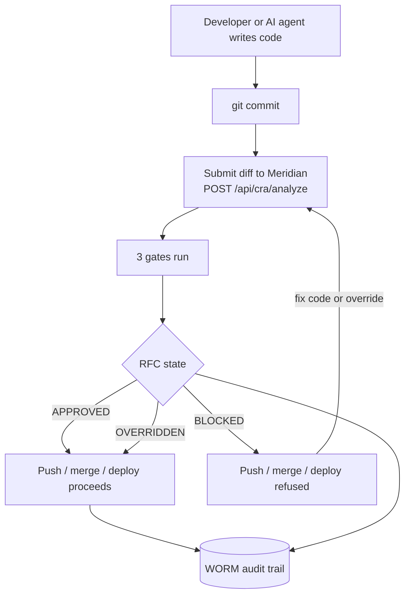

# How Meridian fits into your workflow

Meridian is a service you run yourself. It does not replace your VCS, CI, or tests — it inserts one mandatory checkpoint between "code is written" and "code is deployed".

## The shape of it

## Three places it can sit

Meridian is the same service in all three; only the *trigger* differs.

### 1. Pre-commit (local, fastest feedback)
A developer (or an agent) submits the staged diff before committing. They get the verdict in seconds. This is where AI-assisted workflows benefit most — the agent gets told "this is blocked, fix it" before anything leaves the machine. See [AI-generated code](../how-to/ai-generated-code.md).

### 2. Pre-receive (server-side, the real gate)
A Forgejo/Git pre-receive hook calls Meridian for the pushed diff and **rejects the push** unless the RFC is `APPROVED`/`OVERRIDDEN`. This is the enforcement point that cannot be skipped by a developer who forgot the local check. See [Forgejo integration](../integrations/forgejo.md).

### 3. CI step (PR gating)
A GitHub Actions / CI job submits the PR diff and fails the build if the RFC is not approved. See [GitHub integration](../integrations/github.md).

!!! tip "Defence in depth"
    The strongest setup combines a local pre-commit check (fast feedback) with a server-side pre-receive gate (cannot be bypassed). The CI step is a good middle ground if you cannot install server hooks.

## What Meridian does *not* touch

- It does not store your source code permanently — it analyses the diff and keeps the RFC (findings + verdict), not your repo.
- It does not run your tests. Keep your existing test suite; the gate is orthogonal.
- It does not deploy anything. It only says yes/no to a change.

## Self-hosted and air-gap

Meridian runs as Docker containers you control. With the LLM tier set to Ollama-only and no external API keys, it makes **no outbound calls** — suitable for air-gapped environments. Cloud SAST products cannot do this. See [LLM cost control](../how-to/llm-cost-control.md) for the offline setup.

Next: [Get it running with Docker Compose](../getting-started/docker-compose.md)

