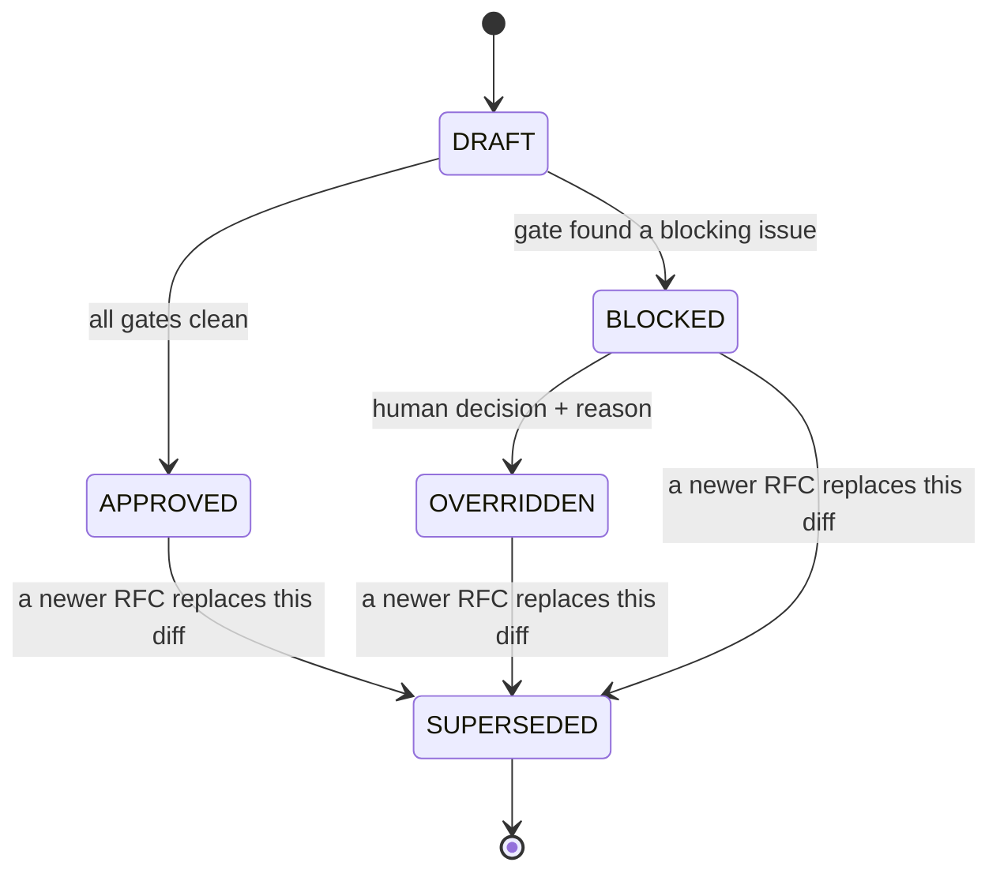

# What is an RFC?

In Meridian an **RFC** (Request for Change) is the record of one decision about one diff. Every diff you submit creates exactly one RFC. The RFC is the thing that gets blocked, approved, or overridden — and the thing your audit trail preserves.

## The lifecycle

| State | Meaning | Can the change ship? |
|-------|---------|----------------------|
| `DRAFT` | The diff was received; analysis is in progress | No |
| `BLOCKED` | At least one gate produced a blocking finding | **No** |
| `APPROVED` | All gates passed cleanly | **Yes** |
| `OVERRIDDEN` | A human accepted a blocked change and recorded why | **Yes** (with a recorded reason) |
| `SUPERSEDED` | A newer RFC for the same change replaced this one | N/A — historical |

## Why states matter

The state is what your CI gate keys off. A pre-receive hook or a CI step asks Meridian for the RFC matching the diff and refuses to proceed unless the state is `APPROVED` or `OVERRIDDEN`. There is no "warn and continue" — that is the whole point.

## Identity: the diff hash

An RFC is tied to a specific diff via a content hash. If the diff changes (even by one character), it is a *different* RFC. This is why you cannot:

- get an approval, then quietly push a modified diff (the hash no longer matches),
- override RFC `A` and have it apply to RFC `B`.

If you rebase or amend, you produce a new diff and therefore a new RFC; the old one becomes `SUPERSEDED`. This prevents the classic "approved one thing, shipped another" attack.

## Override is a recorded act, not a bypass

Overriding does not delete the findings. It records that a named human decided to accept them, with a reason, at a time. That record is written to the [WORM audit trail](../scenarios/regulated.md). An override is the *honest* path for a false positive or an accepted risk — see [Block and override](../how-to/block-and-override.md).

## What an RFC contains

- the diff hash and metadata (repo, branch, commit message),
- the findings from each of the three gates,
- the current state and its history,
- override reason and actor, if any.

You retrieve an RFC over the API — see [API endpoints](../reference/api-endpoints.md).

Next: [How Meridian fits into your workflow](how-meridian-fits.md)

